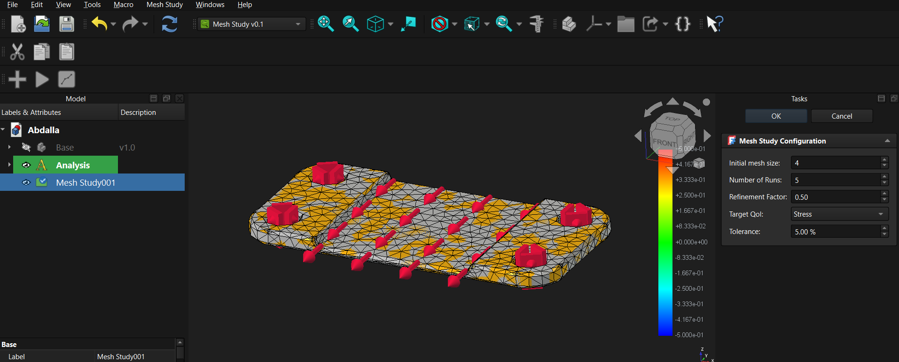
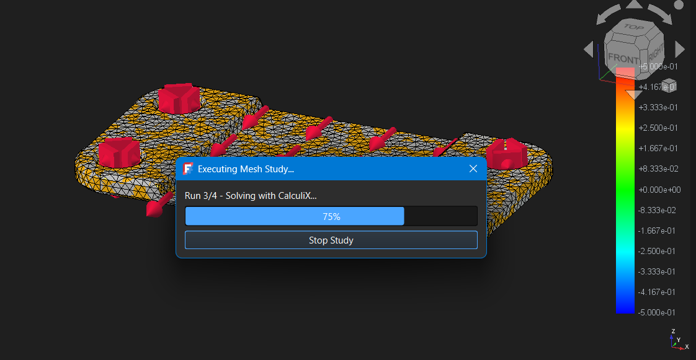
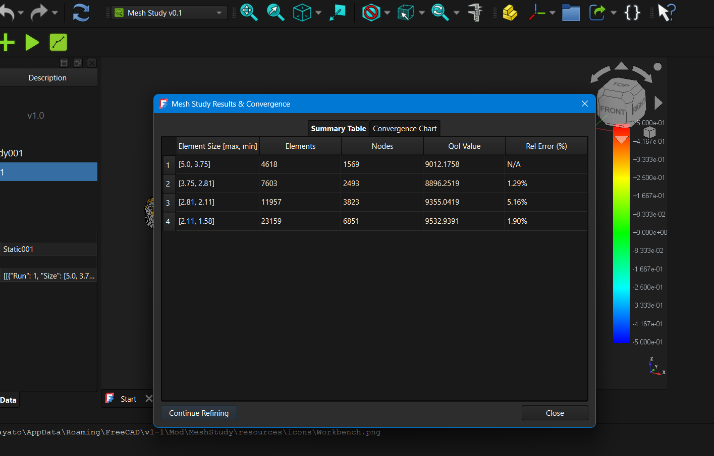
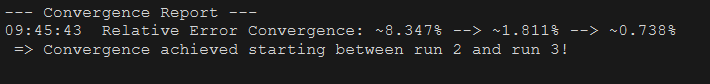
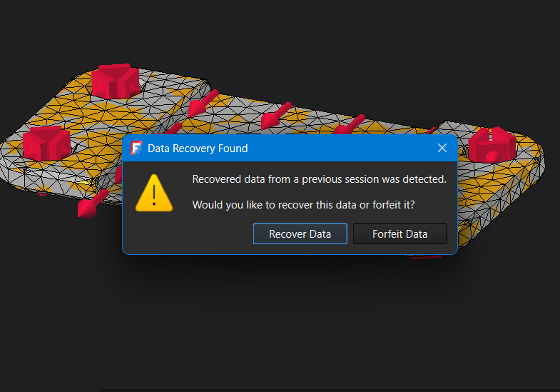

# Mesh Study
A workbench that automates mesh convergence studies for FEM in FreeCAD software.

## Problem to solve:  
Mesh independency is a fundemental requirement in every finit element analysis (FEA), to make sure the simulation results are accurate enough, but in FreeCAD it has to be done manualy, repeating the simulation acrose different mesh sizes, which take so much time, and can be so annoing to do.  

## Solution:  
**Mesh Study** is a modular FreeCAD workbench designed to automate mesh refinement studies for finite element analysis (FEA).It automatically runs simulationes with varying mesh sizes, and presents results clearly in tables and charts, saved as result objects nested under the main `MeshStudy` object in the tree view.  

---

## 🚀 Key Features

* **Tree View Integration**: All simulation results are saved automatically as child result objects nested directly beneath the main `MeshStudy` container in the tree view.
* **Comprehensive Results Visualization**: Displays output outcomes through organized data tables and convergence charts.
* **Extensible Structure**: Extensible analysis, refinement, and QoI strategies.
    *  **Extensible Analysis**: It supportes static structural analysis, with a scope to add modal and thermal anlysis.
    *  **Extensible Refinement**: It supportes uniform refinement factor method (uniform h), with a scope to add adaptive refinement strategies.
    * **Extensible QoI**: it captures stress or displacment, with a scope to add more quantaties (together or each), and more ways to capture QoI (maximum, exact node... etc.).
---

## 🛠️ Usage Guide

1. **Preparation**: Open your FreeCAD document containing your 3D CAD model and a fully configured `FEM Analysis` container.  
Important Note: Netgen Meshing is not supported yet. Gmsh Meshing only.   

2. **Initialize Study**: Select your 'analysis' container and switch to the **Mesh Study** workbench, then click **Add Study** to create a `MeshStudy` object in the tree view.  

3. **Configure Parameters**: Adjust properties such as mesh sizes, refinement factors and quantity of interest from the task panel.  

4. **Run Study**: Click **Run Study** to execute simulations across different mesh sizes automatically.  

5. **Executions**: Execution is done automatically, running simulations across different mesh sizes, you can stop it by pressing the stop button **between the meshing and solving steps**.  

6. **Review Results**: Inspect the generated data table and chart, also the **convergence report** in the report view, and explore the individual result objects nested under the `MeshStudy` container in the tree view.  




7. **unexpectable crashes and errors**: because the workbench is early released, you may face strange bugs or errors (specialy during execution), thus there is a backup system built in, it is trigared every time you try to run or show resultes.  



---

## 📂 Project Structure

```text
MeshStudy/
├── Documentation/             # Documentation and references
├── freecad/
│   └── MeshStudy/             # Namespaced Python Package (FreeCAD Standard)
│       ├── __init__.py        # Package initialization
│       ├── init_gui.py        # GUI Initialization for the workbench
│       ├── core/              # Core logic, limits, and convergence math
│       ├── fem/               # FreeCAD FEM and solver adapters
│       ├── gui/               # Commands, task panels, dialogs, and widgets
│       ├── objects/           # FreeCAD Document Object Model (MeshStudy & Results)
│       ├── predict/           # Intelligence layer (for the future)
│       ├── services/          # Execution orchestration and run service
│       └── strategies/        # Extensible (analysis, refinement, and QoI) strategies
├── Resources/
│   ├── data/                  # Backup data folder
│   ├── Icons/                 # Icons for UI 
│   └── Media/                 # Screenshots and images for the project
├── .gitignore                 # Git ignore rules
├── CHANGELOG.md               # Version history
├── LICENSE                    # License information
├── package.xml                # Addon Manager metadata
└── README.md                  # Project documentation

If there are any issues, reports, or suggestions, please open a new issue at the [MeshStudy Issues](https://github.com/eng-abdalla-abbas/MeshStudy/issues) page.
Or simply contact me directly at <abdalla.engineering@gmail.com>.