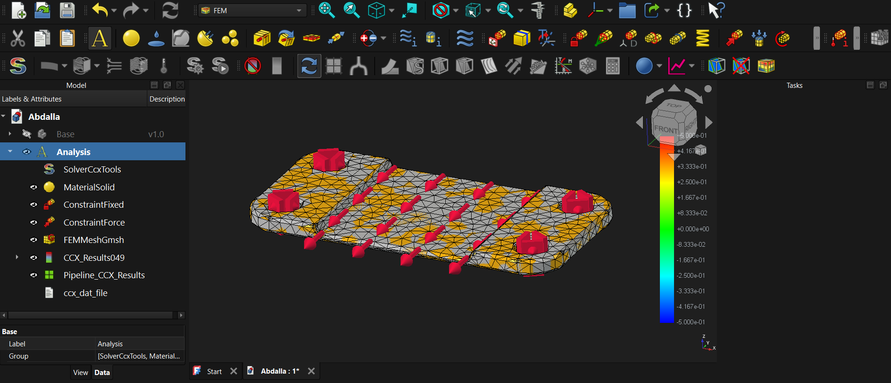
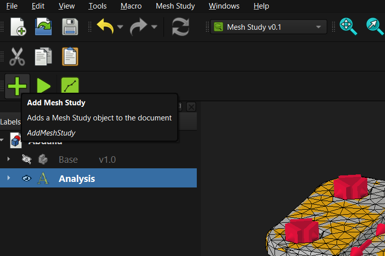
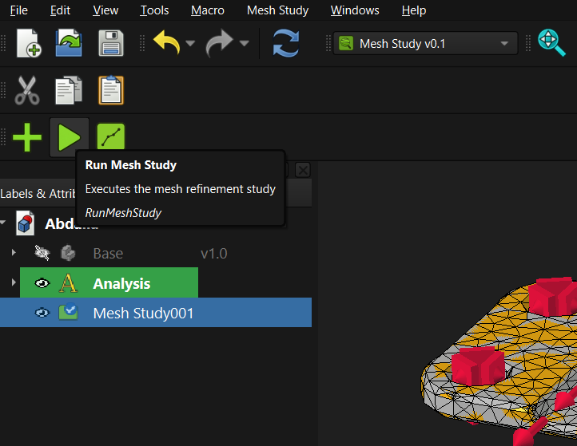
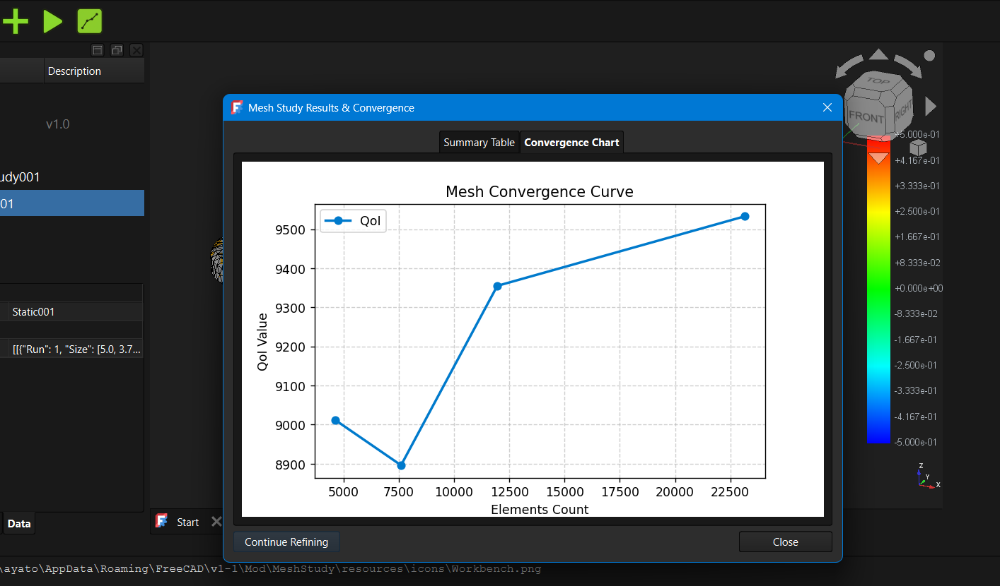
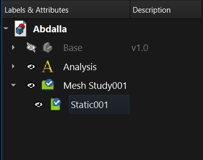

# Mesh Study
A workbench that automates mesh convergence studies for FEM in FreeCAD software.


**Mesh Study Workbench** is a modular FreeCAD workbench designed to automate mesh refinement studies for finite element analysis (FEA).It automatically runs simulationes with varying mesh sizes, and presents results clearly in tables and charts, saved as result objects nested under the main `MeshStudy` object in the tree view.

---

## 🚀 Key Features

* **Tree View Integration**: All simulation results are saved automatically as child result objects nested directly beneath the main `MeshStudy` container in the tree view.
* **Comprehensive Results Visualization**: Displays output outcomes through organized data tables and convergence charts.
* **Extensible Structure**: Extensible analysis, refinement, and QoI strategies.
    *  **Extensible Analysis**: It supportes static structural analysis, with a scope to add modal and thermal anlysis.
    *  **Extensible Refinement**: It supportes uniform refinement factor method (uniform h), with a scope to add adaptive refinement strategies.
    * **Extensible QoI**: it captures stress or displacment, with a scope to add more quantaties (together or each), and more ways to capture QoI (maximum, exact node... etc.).
---

## 🛠️ Usage Guide

1. **Preparation**: Open your FreeCAD document containing your 3D CAD model and a fully configured `FEM Analysis` container.

2. **Initialize Study**: Select your 'analysis' container and switch to the **Mesh Study** workbench, then click **Add Study** to create a `MeshStudy` object in the tree view.

3. **Configure Parameters**: Adjust properties such as mesh sizes, refinement factors and quantity of interest from the task panel.

4. **Run Study**: Click **Run Study** to execute simulations across different mesh sizes automatically.

5. **Executions**: Execution is done automatically, running simulations across different mesh sizes, you can stop it by pressing the stop button **between the meshing and solving steps**.

6. **Review Results**: Inspect the generated data table and chart, and explore the individual result objects nested under the `MeshStudy` container in the tree view.



7. **unexpectable crashes and errors**: because the workbench is early released, you may face strange bugs or errors (specialy during execution), thus there is a backup system built in, it is trigared every time you try to run or show resultes.


---

## 📂 Project Structure

```text
MeshStudyWorkbench/
├── InitGui.py                 # Register workbench and GUI components
├── Init.py                    # Register document object types (non-GUI)
├── package.xml                # Addon Manager metadata
├── README.md                  # Project documentation
├── LICENSE                    # License information
├── CHANGELOG.md               # Version history
├── resources/                 # Icons and UI resources
├── core/                      # Core logic, limits, and convergence math
├── strategies/                # Extensible (analysis, refinement, and QoI) strategies
├── gui/                       # Commands, task panels, dialogs, and widgets
├── fem/                       # FreeCAD FEM and solver adapters
├── objects/                   # FreeCAD Document Object Model (MeshStudy & Results)
├── services/                  # Execution orchestration and run service
└── predict/                   # Intelligence layer (for the future)

If there's any issues, reportes or suggestions, please open a new issue at the [MeshStudy/issues](https://github.com/MeshStudy/issues) page, or contact me directly at <abdalla.engineering@gmail.com> .